# OrcaSlicer Architecture Overview

> **Audience:** AI agents and developers working on the codebase.
> **Scope:** High-level architecture, module inventory, and data-flow diagrams.
> Each module listed here is a candidate for its own detailed doc in the future.

---

## Table of Contents

1. [System Layers](#1-system-layers)
2. [Source Tree Map](#2-source-tree-map)
3. [Core Engine — libslic3r](#3-core-engine--libslic3r)
4. [Slicing Pipeline](#4-slicing-pipeline)
5. [GUI Layer](#5-gui-layer)
6. [Background Processing & Threading](#6-background-processing--threading)
7. [Device & Network Communication](#7-device--network-communication)
8. [Configuration System](#8-configuration-system)
9. [File Format I/O](#9-file-format-io)
10. [Module Index](#10-module-index)

---

## 1. System Layers

OrcaSlicer is organized into four main layers. The core engine is platform-independent; the GUI, device, and utility layers depend on wxWidgets and platform APIs.

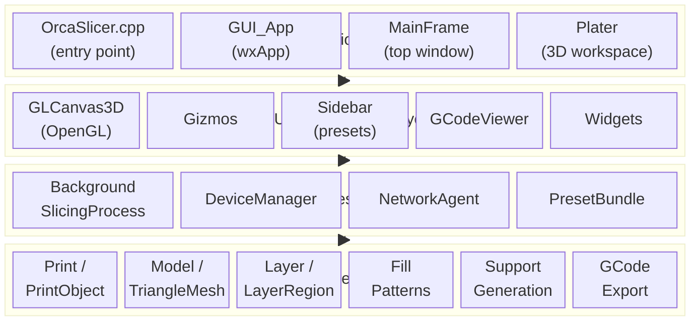

---

## 2. Source Tree Map

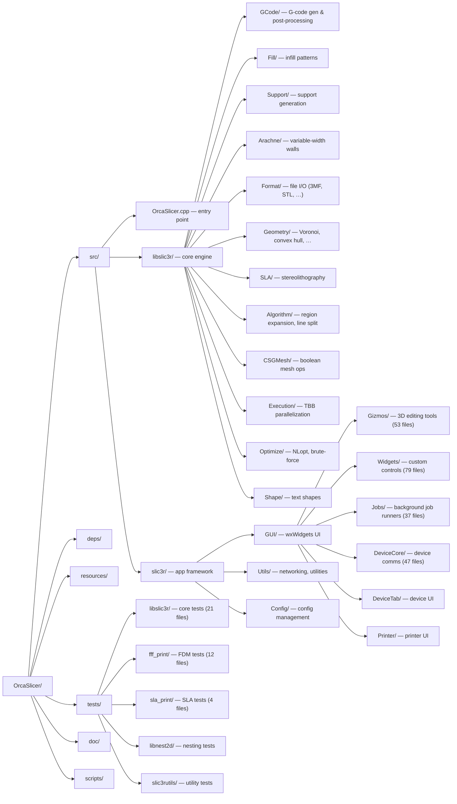

---

## 3. Core Engine — libslic3r

### 3.1 Class Hierarchy

The core engine is organized around three main hierarchies: **Model** (input geometry), **Print** (slicing orchestration), and **Layer** (per-layer output).

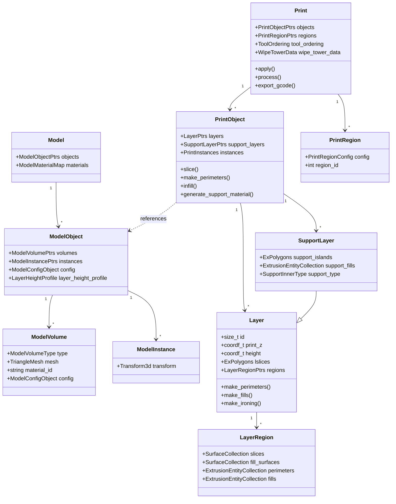

### 3.2 Model Volume Types

`ModelVolume::type` controls how a mesh participates in slicing:

| Type | Purpose |
|------|---------|
| `NORMAL` | Standard printable geometry |
| `NEGATIVE` | Subtracted from model (boolean difference) |
| `MODIFIER` | Overrides settings in its region |
| `SUPPORT_ENFORCER` | Forces support generation in region |
| `SUPPORT_BLOCKER` | Prevents support generation in region |

---

## 4. Slicing Pipeline

### 4.1 Pipeline Overview

Slicing is orchestrated by `Print::process()`, which drives per-object steps followed by global steps. Each step is tracked by an enum-based state machine that supports incremental re-processing when settings change.

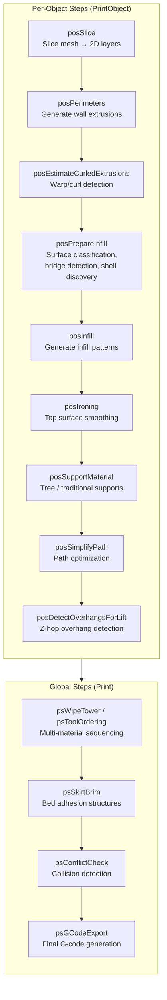

### 4.2 Data Transformation Flow

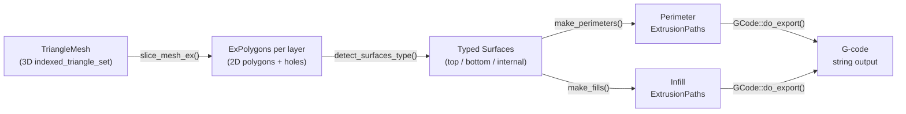

### 4.3 Mesh Slicing Modes

`TriangleMeshSlicer` supports multiple slicing modes via `SlicingMode`:

| Mode | Rule | Use case |
|------|------|----------|
| `Regular` | Non-zero fill | Standard models |
| `EvenOdd` | Even-odd fill | Models with self-intersections |
| `Positive` | CCW contours only | Clean outer shells |
| `PositiveLargestContour` | Single largest CCW | Vase / spiral mode |

### 4.4 Infill Patterns

The `Fill` base class is subclassed for each pattern. Key patterns:

| Pattern | Class | Description |
|---------|-------|-------------|
| Rectilinear | `FillRectilinear` | Parallel lines, alternating angle |
| Gyroid | `FillGyroid` | TPMS-based, isotropic strength |
| Honeycomb | `FillHoneycomb` | Hex grid pattern |
| Lightning | `FillLightning` | Sparse tree-based infill |
| Concentric | `FillConcentric` | Inward-offset contours |
| Adaptive Cubic | `FillAdaptive` | Density varies near surfaces |
| Cross Hatch | `FillCrossHatch` | Crossed line patterns |
| 3D Honeycomb | `Fill3DHoneycomb` | Layer-shifted hex grid |

### 4.5 Support Generation

Two support strategies are available, selected by `SupportMaterialStyle`:

| Strategy | Classes | Description |
|----------|---------|-------------|
| Traditional | `SupportMaterial` | Grid/rectilinear pillars |
| Tree | `TreeSupport`, `TreeSupportData` | Organic branching structure with `SupportNode` tree |

Tree supports build a node graph (`SupportNode` with parent/child pointers) that branches from contact points down to the build plate, using collision avoidance fields computed per-layer.

---

## 5. GUI Layer

### 5.1 Component Hierarchy

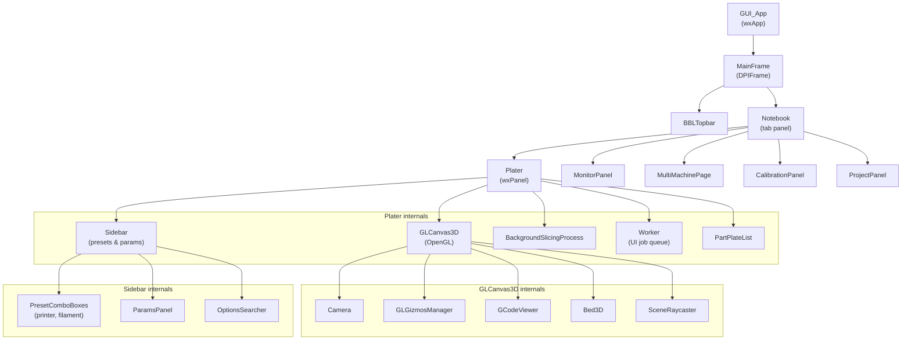

### 5.2 Main Tabs

| Tab enum | Panel | Purpose |
|----------|-------|---------|
| `tpHome` | Home | Start page, recent projects |
| `tp3DEditor` | Plater | 3D model editing and slicing |
| `tpPreview` | Plater (preview mode) | G-code visualization |
| `tpMonitor` | MonitorPanel | Device monitoring and control |
| `tpMultiDevice` | MultiMachinePage | Multi-printer management |
| `tpProject` | ProjectPanel | Project management |
| `tpCalibration` | CalibrationPanel | Calibration workflows |

### 5.3 Gizmos (3D Editing Tools)

The `GLGizmosManager` hosts interactive gizmo tools in the 3D viewport (53 source files in `GUI/Gizmos/`). These handle operations like move, rotate, scale, cut, measure, emboss text, paint-on supports, seam placement, and multi-material painting.

### 5.4 Event Flow

The GUI uses wxWidgets custom events for loose coupling between components:

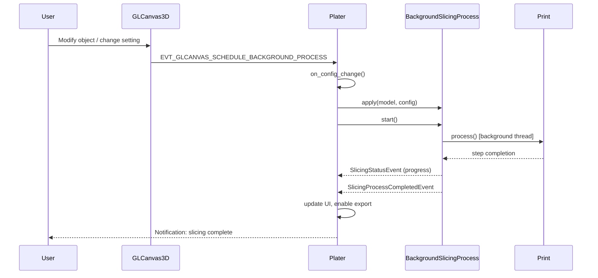

---

## 6. Background Processing & Threading

### 6.1 Threading Model

### 6.2 BackgroundSlicingProcess States

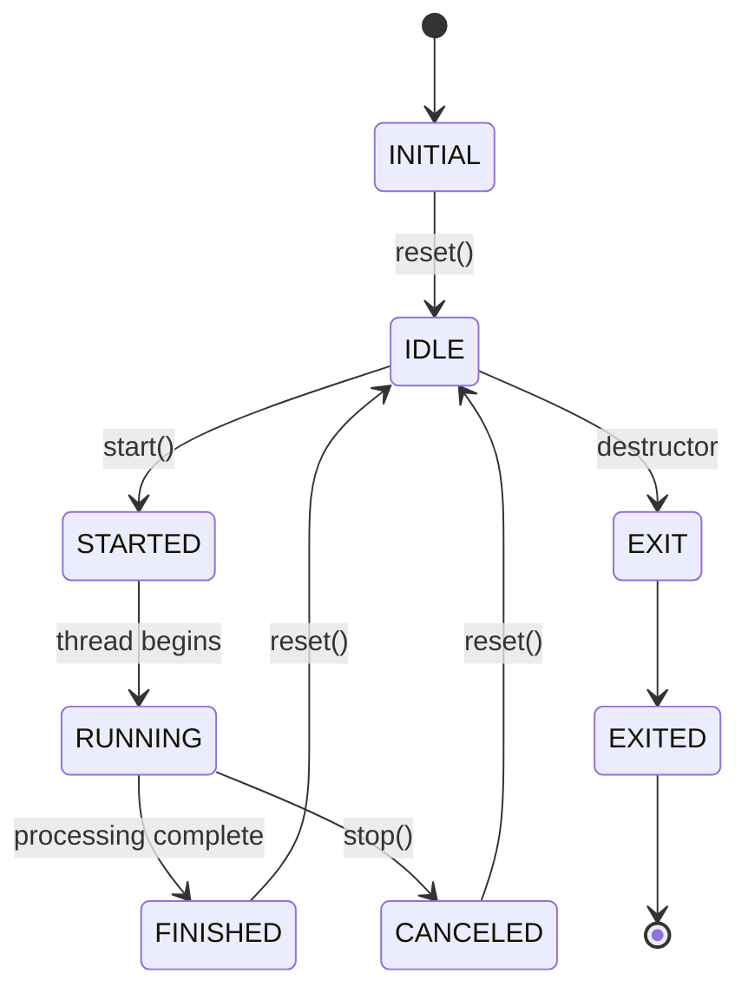

### 6.3 Synchronization

- **Mutex + condition variable** guards the `BackgroundSlicingProcess` state machine
- **TBB** is used internally by `libslic3r` for data-parallel operations (layer processing, infill)
- **`execute_ui_task()`** marshals results from background threads back to the main thread via wxWidgets event queue
- **Worker** is a separate job queue for non-slicing async tasks (arranging, exporting, uploading)

---

## 7. Device & Network Communication

### 7.1 Architecture Overview

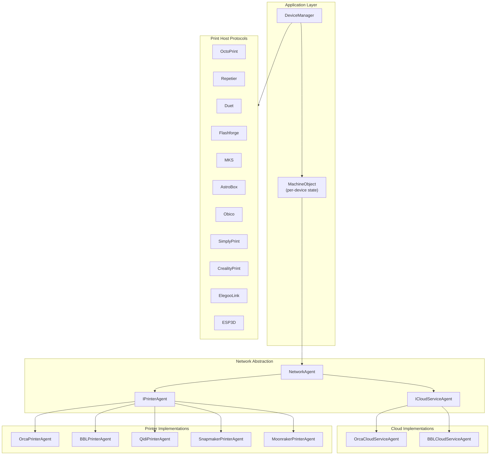

### 7.2 Network Agent Design

`NetworkAgent` uses a **sub-agent composition** pattern:
- `ICloudServiceAgent` — interface for cloud account/fleet management
- `IPrinterAgent` — interface for direct printer communication (LAN or cloud-relayed)
- Agents are dynamically swappable at runtime via `set_printer_agent()`

### 7.3 Device Discovery

- **Bonjour/mDNS** (`Bonjour.*`) for LAN discovery
- **SSDP** for network device announcements
- **Cloud API** for account-linked devices
- Discovered devices are registered as `MachineObject` instances in `DeviceManager`

### 7.4 MachineObject Subsystems

Each `MachineObject` composes device subsystems:

| Subsystem | Class | Purpose |
|-----------|-------|---------|
| Lamp | `DevLamp` | Chamber light control |
| Nozzle | `DevNozzleSystem` | Nozzle configuration |
| Filament | `DevFilaSystem` | Filament/AMS management |
| Fan | `DevFan` | Fan speed control |
| Bed | `DevBed` | Bed temperature/type |
| HMS | `DevHMS` | Health Management System (errors) |
| Config | `DevConfig` | Device configuration |
| Extension | `DevExtensionTool` | Tool changer support |

---

## 8. Configuration System

### 8.1 Config Class Hierarchy

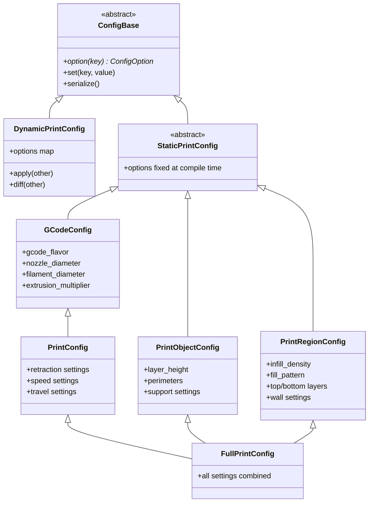

### 8.2 Preset System

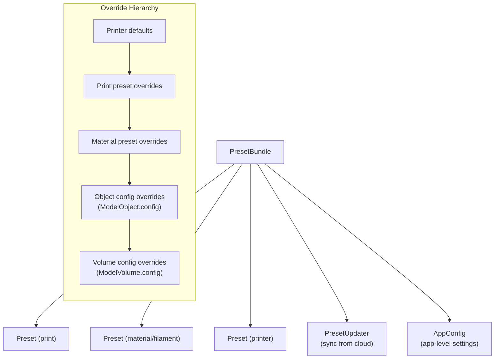

Presets are stored as INI-style files in the user data directory. Each preset contains a `DynamicPrintConfig`. The `PresetBundle` manages collections of print, material, and printer presets and resolves inheritance between them.

### 8.3 Key Config Enums

| Enum | Values (selection) | Controls |
|------|-------------------|----------|
| `InfillPattern` | Rectilinear, Honeycomb, Gyroid, Lightning, Concentric, … | Fill pattern selection |
| `SupportMaterialStyle` | Default, TreeSlim, TreeStrong, TreeHybrid, … | Support strategy |
| `SeamPosition` | Nearest, Aligned, Rear, Random | Seam placement |
| `GCodeFlavor` | MarlinLegacy, Klipper, RepRapFirmware, … | G-code dialect |
| `IroningType` | NoIroning, TopSurfaces, TopmostOnly, AllSolid | Ironing mode |
| `SlicingMode` | Regular, EvenOdd, CloseHoles | Mesh slicing rule |

---

## 9. File Format I/O

### 9.1 Import / Export Pipeline

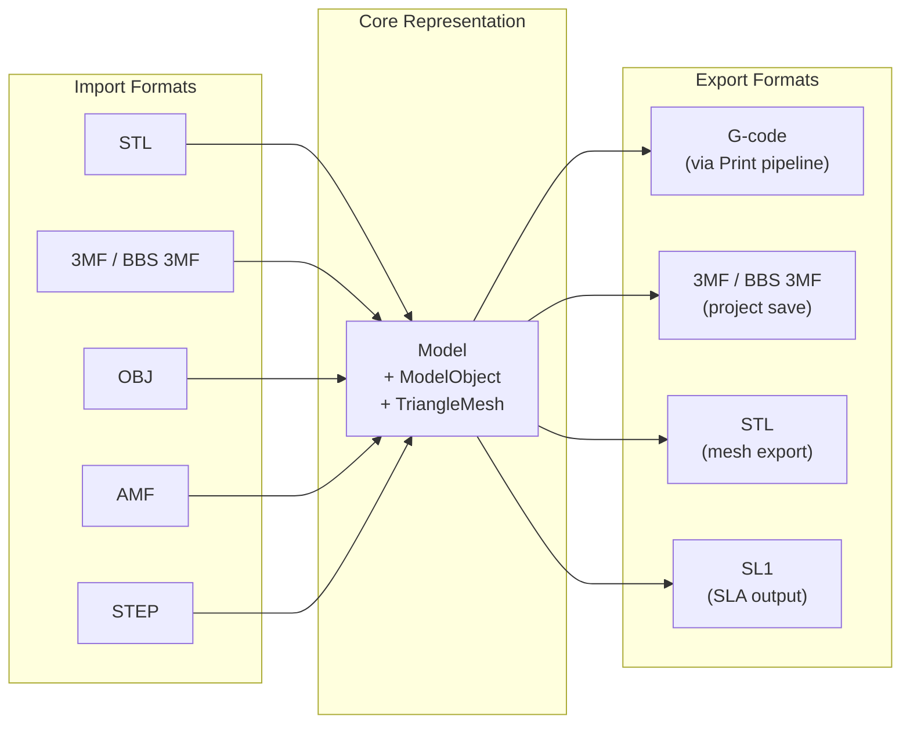

### 9.2 Format Details

| Format | Files | Read | Write | Notes |
|--------|-------|------|-------|-------|
| **3MF** | `3mf.*`, `bbs_3mf.*` | Yes | Yes | Native project format with BBS extensions for multi-material, plate layout, metadata |
| **STL** | `STL.*` | Yes | Yes | Binary and ASCII |
| **OBJ** | `OBJ.*`, `objparser.*` | Yes | No | With material/color support via `ObjColorUtils` |
| **AMF** | `AMF.*` | Yes | Yes | XML-based with color/material |
| **STEP** | `STEP.*` | Yes | No | CAD format via OpenCASCADE |
| **SL1** | `SL1.*` | Yes | Yes | SLA archive format |
| **SVG** | `svg.*` | No | Yes | For SLA layer export |

### 9.3 G-code Post-Processing Chain

After extrusion paths are generated, the G-code export pipeline applies several post-processors in sequence:

| Processor | Class | Purpose |
|-----------|-------|---------|
| Seam placement | `SeamPlacer` | Position layer-start seams |
| Wipe | `Wipe` | Wipe nozzle on retraction |
| Ooze prevention | `OozePrevention` | Multi-extruder ooze control |
| Wipe tower | `WipeTowerIntegration` | Color transition priming |
| Cooling | `CoolingBuffer` | Fan speed and slowdown |
| Fan mover | `FanMover` | Advance fan commands |
| Pressure equalization | `PressureEqualizer` | Pressure advance tuning |
| Adaptive PA | `AdaptivePAProcessor` | Dynamic pressure advance |
| Spiral vase | `SpiralVase` | Continuous Z for vase mode |
| Conflict checker | `ConflictChecker` | Toolhead collision detection |
| Arc fitting | `ArcWelder` | Convert segments to arcs |

---

## 10. Module Index

Every major module in the codebase, grouped by layer. Each is a candidate for a dedicated `doc/<module>.md`.

### Core Engine (`src/libslic3r/`)

| Module | Key Files | Description |
|--------|-----------|-------------|
| **Print orchestration** | `Print.*`, `PrintObject.*`, `PrintBase.*`, `PrintApply.*`, `PrintRegion.*` | Top-level slicing state machine and object management |
| **Model** | `Model.*`, `ModelArrange.*` | In-memory 3D model representation |
| **Layer** | `Layer.*`, `LayerRegion.*` | Per-layer slice data and region processing |
| **TriangleMesh** | `TriangleMesh.*`, `TriangleMeshSlicer.*`, `TriangleSelector.*` | Mesh data structure and slicing |
| **GCode** | `GCode/` (45 files) | G-code generation, post-processing, and analysis |
| **Fill** | `Fill/` (28 files) | Infill pattern implementations |
| **Support** | `Support/` (15 files) | Tree and traditional support generation |
| **Arachne** | `Arachne/` (8 files) | Variable-width wall generation via skeletal trapezoidation |
| **Format** | `Format/` (23 files) | File I/O for all supported formats |
| **Geometry** | `Geometry/` (18 files) | Voronoi diagrams, convex hulls, arc welding, medial axis |
| **SLA** | `SLA/` (32 files) | SLA-specific slicing, supports, hollowing, rasterization |
| **Clipper** | `clipper.*`, `ClipperUtils.*`, `Clipper2Utils.*` | 2D polygon clipping and offsetting |
| **Perimeter** | `PerimeterGenerator.*`, `VariableWidth.*` | Wall path generation |
| **Bridge detection** | `BridgeDetector.*` | Unsupported span detection and angle optimization |
| **Flow** | `Flow.*` | Extrusion width/height calculations |
| **Config** | `Config.*`, `PrintConfig.*`, `Preset.*`, `PresetBundle.*` | Settings definitions, presets, and bundles |
| **Extrusion** | `ExtrusionEntity.*`, `ExtrusionEntityCollection.*` | Extrusion path data structures |
| **Arrange** | `Arrange.*`, `Orient.*` | Auto-arrangement and orientation of objects on plate |
| **Brim** | `Brim.*` | Brim generation for bed adhesion |
| **Emboss** | `Emboss.*`, `EmbossShape.hpp` | Text and shape embossing |
| **CSGMesh** | `CSGMesh/` (7 files) | Constructive Solid Geometry boolean operations |
| **Algorithm** | `Algorithm/` (4 files) | Region expansion, line splitting |
| **Execution** | `Execution/` (3 files) | Parallel execution models (sequential, TBB) |
| **Optimize** | `Optimize/` (3 files) | NLopt and brute-force optimization |
| **Multi-material** | `MultiMaterialSegmentation.*`, `FlushVolCalc.*` | MMU segmentation and flush volumes |
| **Elephant foot** | `ElephantFootCompensation.*` | First-layer compensation |
| **Slicing** | `Slicing.*`, `SlicingAdaptive.*` | Layer height computation and adaptive slicing |
| **Spatial indexing** | `AABBTreeIndirect.hpp`, `KDTreeIndirect.hpp`, `AABBMesh.*` | Spatial search structures |
| **Pathfinding** | `ShortestPath.*`, `JumpPointSearch.*`, `AStar.hpp` | Path optimization algorithms |
| **Platform** | `Platform.*`, `MacUtils.hpp` | OS-specific abstractions |

### GUI Layer (`src/slic3r/GUI/`)

| Module | Key Files | Description |
|--------|-----------|-------------|
| **Application** | `GUI_App.*` | wxApp subclass, lifecycle, global services |
| **MainFrame** | `MainFrame.*` | Top-level window, menu bar, tab navigation |
| **Plater** | `Plater.*` | Central 3D workspace, model/plate management |
| **GLCanvas3D** | `GLCanvas3D.*` | OpenGL rendering, input handling, camera |
| **Gizmos** | `Gizmos/` (53 files) | Interactive 3D editing tools (move, rotate, cut, paint, …) |
| **Widgets** | `Widgets/` (79 files) | Custom wxWidgets controls and composite panels |
| **Jobs** | `Jobs/` (37 files) | Background job runners (arrange, orient, export, upload) |
| **GCodeViewer** | `GCodeViewer.*` | G-code preview visualization |
| **BackgroundSlicingProcess** | `BackgroundSlicingProcess.*` | Async slicing thread management |
| **Sidebar** | embedded in `Plater.*` | Preset selection, filament management, search |
| **ParamsPanel** | `ParamsPanel.*` | Setting tabs and parameter editing |
| **MonitorPanel** | `MonitorPanel.*` | Device status monitoring |
| **MultiMachinePage** | `MultiMachinePage.*` | Multi-device management |
| **CalibrationPanel** | `CalibrationPanel.*` | Printer calibration workflows |
| **Selection** | `Selection.*` | Object/instance selection management |
| **Camera** | `Camera.*` | 3D viewport camera control |
| **Bed3D** | `Bed3D.*` | Build plate visualization |
| **Notifications** | `NotificationManager.*` | Toast notification system |
| **Search** | `Search.*` | Settings search engine |
| **DeviceCore** | `DeviceCore/` (47 files) | Device communication protocols |
| **DeviceTab** | `DeviceTab/` (4 files) | Device management UI |
| **Printer** | `Printer/` (4 files) | Printer-specific UI components |

### Services & Utilities (`src/slic3r/Utils/`)

| Module | Key Files | Description |
|--------|-----------|-------------|
| **NetworkAgent** | `NetworkAgent.*`, `NetworkAgentFactory.*` | Network abstraction and agent factory |
| **Cloud agents** | `OrcaCloudServiceAgent.*`, `BBLCloudServiceAgent.*`, `ICloudServiceAgent.hpp` | Cloud service implementations |
| **Printer agents** | `OrcaPrinterAgent.*`, `BBLPrinterAgent.*`, `QidiPrinterAgent.*`, `SnapmakerPrinterAgent.*`, `MoonrakerPrinterAgent.*` | Per-vendor printer communication |
| **Print hosts** | `PrintHost.*`, `OctoPrint.*`, `Repetier.*`, `Duet.*`, `Flashforge.*`, `MKS.*`, … | Third-party print host protocols |
| **DeviceManager** | `GUI/DeviceManager.*` | Device lifecycle and state management |
| **Bonjour** | `Bonjour.*` | mDNS/Bonjour device discovery |
| **HTTP** | `Http.*`, `WebSocketClient.hpp` | HTTP and WebSocket client |
| **UndoRedo** | `UndoRedo.*` | Undo/redo stack implementation |
| **PresetUpdater** | `PresetUpdater.*` | Preset synchronization from cloud |
| **CalibUtils** | `CalibUtils.*` | Calibration utilities |

### Test Suites (`tests/`)

| Suite | Directory | Files | Covers |
|-------|-----------|-------|--------|
| **libslic3r** | `tests/libslic3r/` | 21 | Core geometry, algorithms, file formats |
| **fff_print** | `tests/fff_print/` | 12 | FDM slicing, G-code generation, fills |
| **sla_print** | `tests/sla_print/` | 4 | SLA processing and supports |
| **libnest2d** | `tests/libnest2d/` | — | 2D nesting algorithms |
| **slic3rutils** | `tests/slic3rutils/` | — | Utility functions |

---

## Appendix: Key Entry Points for Common Tasks

| Task | Start here |
|------|-----------|
| Understand the slicing pipeline | `Print::process()` in `libslic3r/Print.cpp` |
| Add a new print setting | `PrintConfig.cpp` → GUI in `ParamsPanel` or `Tab` |
| Add a new infill pattern | Subclass `Fill` in `libslic3r/Fill/` |
| Modify perimeter generation | `PerimeterGenerator.cpp`, `Arachne/WallToolPaths.cpp` |
| Change G-code output | `GCode.cpp`, post-processors in `GCode/` |
| Add support for a new printer | JSON profile in `resources/profiles/`, printer agent in `Utils/` |
| Add a new 3D gizmo | `GUI/Gizmos/`, register in `GLGizmosManager` |
| Add a new file format | Implement reader/writer in `libslic3r/Format/` |
| Modify the UI layout | `MainFrame.cpp`, `Plater.cpp`, `Sidebar` |
| Add a new background job | `GUI/Jobs/`, use `Worker` queue |
| Debug device communication | `DeviceManager`, relevant printer agent in `Utils/` |
